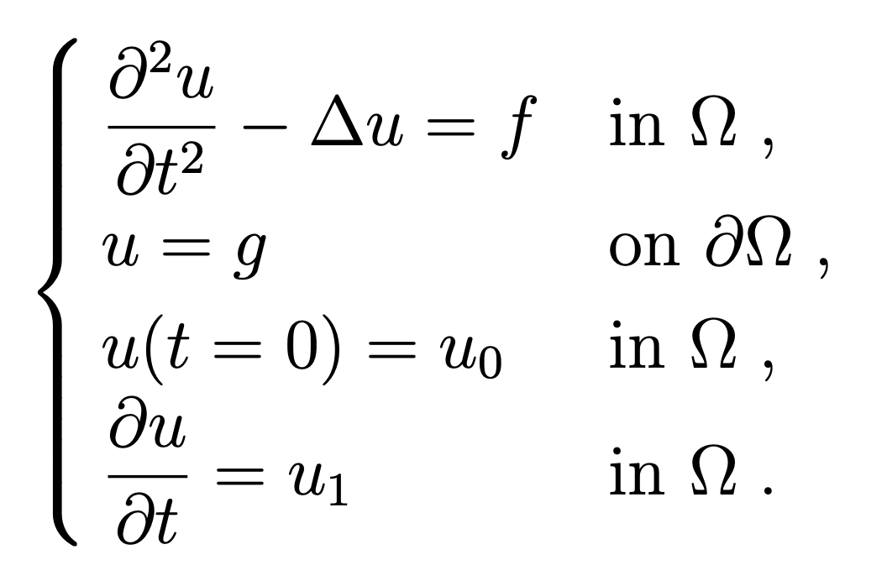

### Wave Equation

#### Problem statement

Implement a 2D finite element solver for the wave equation in 2D:

<p align="center">
    
</p>

#### Mesh handling

Mesh binaries are intentionally not kept in the repository.

- Gmsh geometry files: `mesh/*.geo`
- Mesh generation script: `scripts/generate_mesh.sh`

Generate meshes locally (requires `gmsh`):

```bash
./scripts/generate_mesh.sh
```
---

## Original repository instructions

### Organizing the source code
Please place all your sources into the `src` folder.

Binary files must not be uploaded to the repository (including executables).

Mesh files should not be uploaded to the repository. If applicable, upload `gmsh` scripts with suitable instructions to generate the meshes (and ideally a Makefile that runs those instructions). If not applicable, consider uploading the meshes to a different file sharing service, and providing a download link as part of the building and running instructions.

## Solver usage

### Build

```bash
cmake -S . -B cmake-build-release -DCMAKE_BUILD_TYPE=Release
cmake --build cmake-build-release -j
```

### Run with config

```bash
mpirun -n 4 ./cmake-build-release/wave-equation --config configs/theta_crank_nicolson.cfg
```

### Available presets

- `configs/theta_forward.cfg`
- `configs/theta_crank_nicolson.cfg`
- `configs/theta_backward.cfg`
- `configs/newmark_avg_accel.cfg`
- `configs/newmark_central_difference.cfg`
- `configs/convergence_space.cfg`
- `configs/convergence_time.cfg`
- `configs/convergence_both.cfg`

### Convergence outputs

Convergence runs write CSV files in `results/`:

- `results/convergence_space.csv`
- `results/convergence_time.csv`

Generate plots with:

```bash
python3 scripts/plot_convergence.py --space-csv results/convergence_space.csv --time-csv results/convergence_time.csv --output results/convergence.png
```
