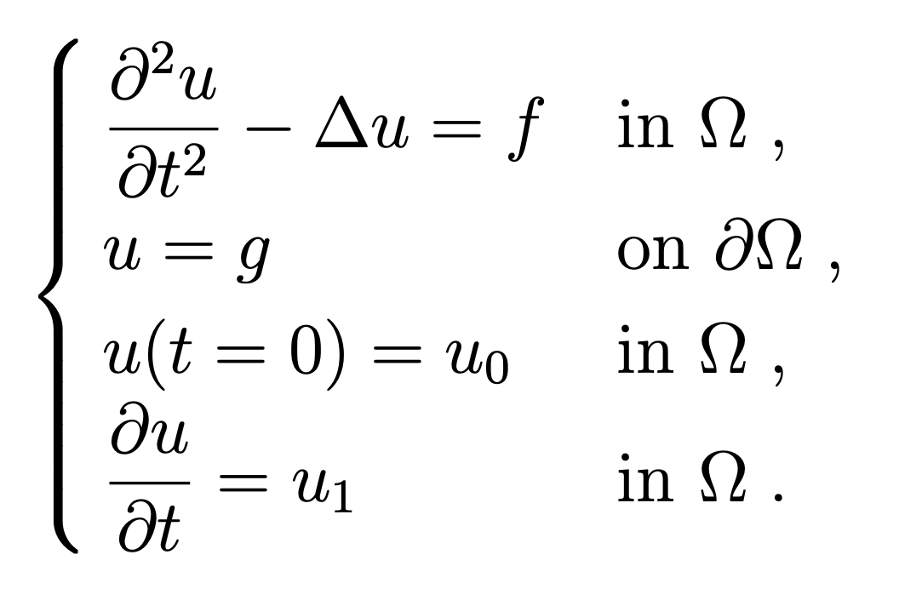

### Wave Equation

#### Problem statement

Implement a 2D finite element solver for the wave equation in 2D:

<p align="center">
    
</p>

#### Mesh handling

Mesh binaries are intentionally not kept in the repository.

- Gmsh geometry files: `mesh/*.geo`
- Mesh generation script: `scripts/generate_mesh.sh`

Generate meshes locally (requires `gmsh`):

```bash
./scripts/generate_mesh.sh
```
---

## Original repository instructions

### Organizing the source code
Please place all your sources into the `src` folder.

Binary files must not be uploaded to the repository (including executables).

Mesh files should not be uploaded to the repository. If applicable, upload `gmsh` scripts with suitable instructions to generate the meshes (and ideally a Makefile that runs those instructions). If not applicable, consider uploading the meshes to a different file sharing service, and providing a download link as part of the building and running instructions.

## Solver usage

### Build

```bash
cmake -S . -B cmake-build-release -DCMAKE_BUILD_TYPE=Release
cmake --build cmake-build-release -j
```

### Run with config

```bash
mpirun -n 4 ./cmake-build-release/wave-equation --config configs/standing_wave/theta_crank_nicolson.cfg
```

### Available presets

Standing wave (`configs/standing_wave/`):
- `theta_forward.cfg`
- `theta_crank_nicolson.cfg`
- `theta_backward.cfg`
- `newmark_avg_accel.cfg`
- `newmark_leapfrog.cfg`

Gaussian pulse (`configs/gaussian_pulse/`):
- `theta_forward.cfg`
- `theta_crank_nicolson.cfg`
- `theta_backward.cfg`
- `newmark_avg_accel.cfg`
- `newmark_leapfrog.cfg`

Boundary-driven examples:
- `configs/rectangle_driven_left_boundary/newmark_avg_accel.cfg`
- `configs/boundary_pulse_left/newmark_avg_accel.cfg`
- `configs/two_sided_driven_boundary/newmark_avg_accel.cfg`

Non-square domain examples:
- `configs/circle_standing_wave/newmark_avg_accel.cfg`
- `configs/donut_angular_mode/newmark_avg_accel.cfg`

Convergence (manufactured square exact solution, `configs/convergence/`):
- `convergence_space.cfg`
- `convergence_time.cfg`
- `convergence_both.cfg`

### Config keys (key=value)

Core:
- `mode = solve | convergence_space | convergence_time | convergence_both`
- `method = theta | newmark`
- `mesh_file`, `fe_degree`, `wave_speed`, `dt`, `n_steps`
- `output_interval`, `output_dir`
- `u0`, `u1`, `f`, `bc`

Method-specific:
- `theta` for `method=theta`
- `beta`, `gamma` for `method=newmark`

Convergence-specific:
- `convergence_mesh_files`
- `convergence_dt_values`
- `convergence_reference_case`
- `convergence_csv_space`
- `convergence_csv_time`

### Convergence outputs

Convergence runs write CSV files in `results/`:

- `results/convergence_space.csv`
- `results/convergence_time.csv`

Generate plots with:

```bash
python3 scripts/plot_convergence.py --space-csv results/convergence_space.csv --time-csv results/convergence_time.csv --output results/convergence.png
```

### Output files

- `solution/`: time-series visualization files (`.vtu` + `.pvtu`) for ParaView.
- `results/`: convergence CSV files and generated plots.
